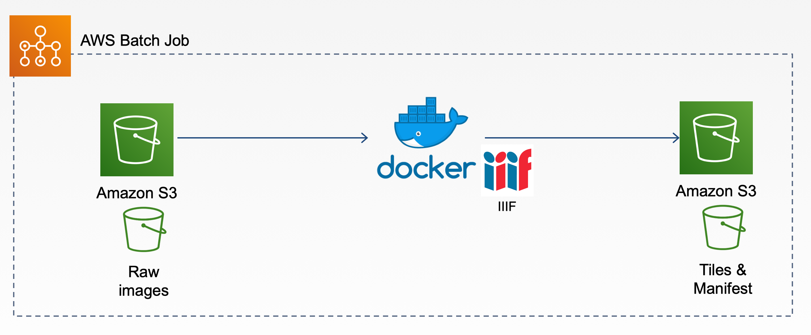

# aws-batch-iiif-generator

## Workflow

1. Upload task file to the batch bucket
2. Batch bucket trigger a lambda function
3. Lambda function read the content in the task file and submit a batch job
4. Each batch job generates tiles and manifests from the original image and upload to the target S3 bucket

1. Pull raw original files from the S3 bucket
2. Generate tiles and manifests
3. Upload to target S3 bucket

## Batch
* Compute environment: [computeenv.json](examples/computeenv.json)
* Job Definition: [jobdefinition.json](examples/jobdefinition.json)
* Job Queue: [jobqueue.json](examples/jobqueue.json)

## S3
* SRC_BUCKET: For raw images and CSV files to be processed
	* Raw image files
	* CSV files
* AWS_BUCKET_NAME: For saving tiles and manifests files
* Batch_Bucket: For task files

## Lambda
* [lambda-example.py](examples/lambda-example.py): Submit a batch job when a task file is upload to a S3 bucket
	* Add S3 trigger: 
		* Event type: ObjectCreated

## IAM
* lambda_function_role: Append Read access to S3 buckets and permission to submit a batch job policy
* ecsInstanceRole: Append Read/Write access to S3 buckets policy

## Task File
* example: [task.json](examples/task.json)

## IIIF S3 Docker image
* [iiif_s3_docker](docker)
* Image at Docker Hub: [yinlinchen/vtl:iiifs3batch](https://cloud.docker.com/repository/docker/yinlinchen/vtl/tags)
